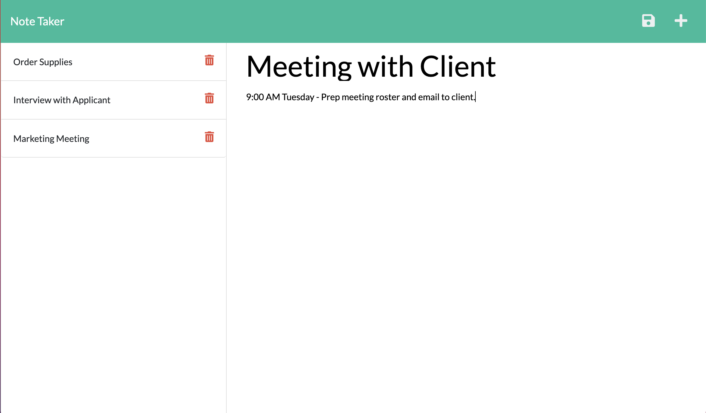

# On Task Note Taker

## Description

This is a note taking application geared toward small business owners. On Task Note Taker allows the user to write and save notes to organize and track tasks. The notes can then be deleted, once a task is accomplished. This app was created using Express in Node.js and is deployed through Heroku.

## Technologies Used

    * Javascript
    * Node.js
    * Express.js
    * UUID NPM
    * Heroku

## What I Learned

As always, referencing documentation for the use of any api, framework, etc. was super important and useful for working through challenges in building this app. This was my first project deployed to Heroku, and it took some reading to get Heroku installed correctly and to prepare my local repo for deployment. Specifically, I got hung up on listening from the right port in my server.js file and found my answer in Heroku's documentation.

I also appreciate the benefit of using modular routing to orangize related code. I can see how this will make life easier when scaling up into more involved applications.

## URL for Heroku deployment

https://on-task-note-taker.herokuapp.com/

## URL for GitHub Repo

https://github.com/ChristinaBohn/on-task-note-taker

## On Task Note Taker Preview

